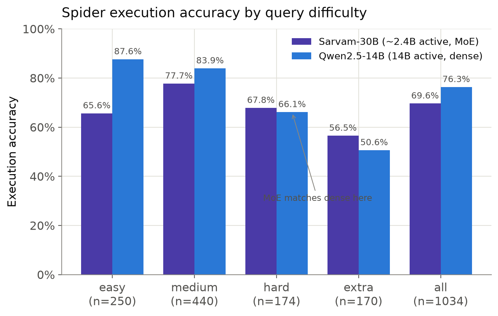
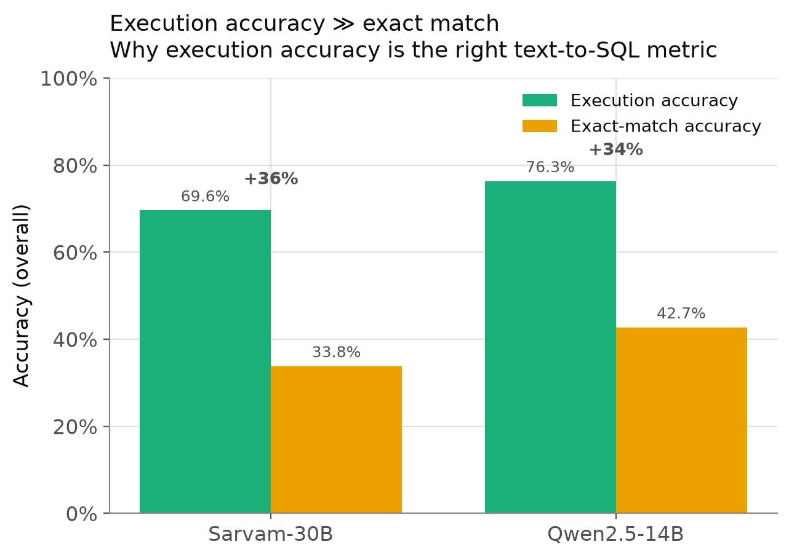
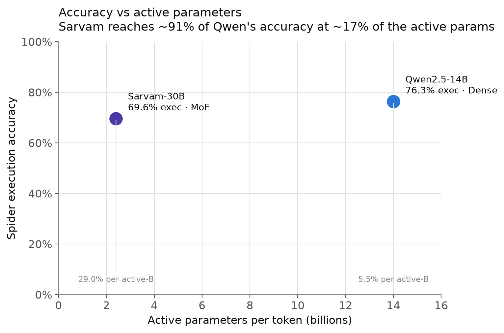
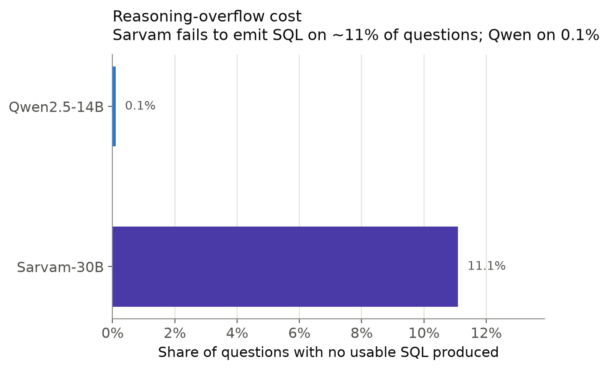
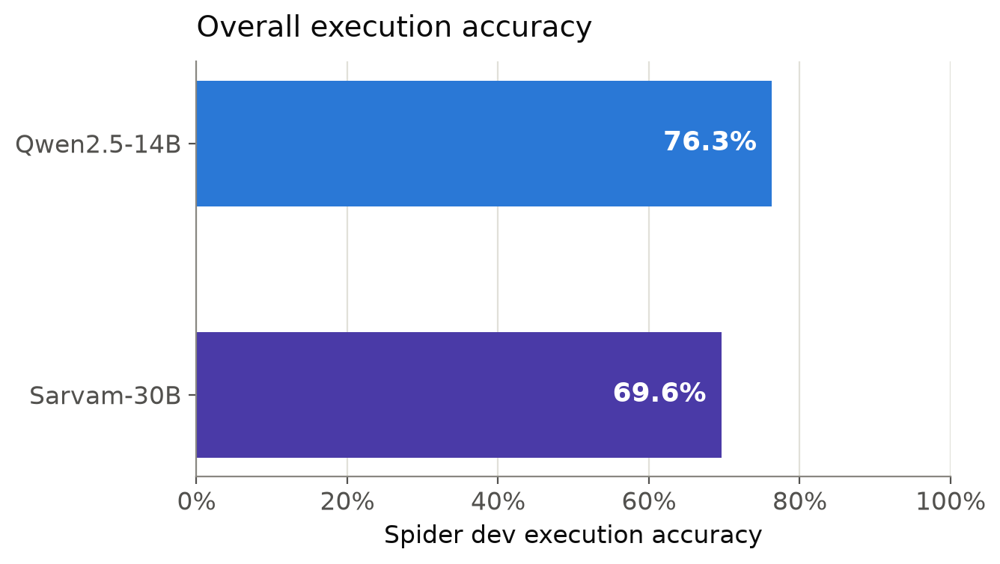

# sarvam-spider-bench

Text-to-SQL benchmarking of local LLMs on the [Spider](https://yale-lily.github.io/spider) dev set, comparing models by **active parameters** rather than total size. Built around a Mixture-of-Experts vs dense comparison: Sarvam-30B (~2.4B active) against Qwen2.5-14B (14B active), both at Q4_K_M, served locally via `llama.cpp`.

The central question: how much execution accuracy does each active parameter buy? A ~2.4B-active MoE reaching close to a 14B-active dense model on a real task is the kind of result that total-parameter comparisons hide.

## Results

Spider dev (1,034 examples), execution accuracy:

| Model | Active params | Type | Easy | Medium | Hard | Extra | **Overall** | No-SQL rate |
|-------|--------------|------|------|--------|------|-------|-------------|-------------|
| Sarvam-30B | ~2.4B | MoE | 0.656 | 0.777 | 0.678 | 0.565 | **0.696** | 11.1% |
| Qwen2.5-14B | 14B | Dense | 0.876 | 0.839 | 0.661 | 0.506 | **0.763** | 0.1% |

Key observations:

- **Qwen leads overall (76.3% vs 69.6%)** but the advantage is concentrated in easy/medium queries.
- **On hard/extra queries the models converge** — Sarvam slightly edges Qwen on both. Reasoning helps where the task is genuinely complex.
- **Sarvam's easy-bucket weakness is a reasoning pathology**, not lack of capability: it over-reasons on trivial questions, occasionally overflowing the generation budget without emitting SQL (the 11.1% no-SQL rate, concentrated in easy). Qwen, non-reasoning, has no such cost.
- **Execution accuracy ≫ exact-match accuracy** for both models (e.g. 69.6% vs 33.8% for Sarvam), because the models write semantically-correct but structurally-different SQL (`COUNT(DISTINCT x)` vs `count(*)`, subquery vs join). This is why execution accuracy is the metric used here.
- **Accuracy per active billion params:** Sarvam ~29%/B, Qwen ~5.5%/B — a ~5x efficiency gap on this task.

> These are single-task results (Spider, Q4_K_M, the prompt in this repo). They are an efficiency finding, not a general capability claim.

## Visual Results

### Execution accuracy by difficulty



Qwen is stronger overall, especially on easy and medium examples. On hard and extra-hard examples, the gap closes and Sarvam slightly edges Qwen, suggesting the MoE reasoning behavior helps more when the SQL structure is genuinely complex.

### Execution accuracy vs exact match



Both models score much higher by execution accuracy than by exact-set match. This is why the benchmark emphasizes execution: semantically equivalent SQL can look structurally different while returning the same result.

### Accuracy per active parameter



This is the main efficiency claim. Sarvam reaches a large fraction of Qwen's execution accuracy while using far fewer active parameters per token, producing much higher accuracy per active billion parameters.

### No-SQL / placeholder rates



This captures generation failures where no usable SQL was extracted and the placeholder `SELECT` was written to preserve alignment. Sarvam's higher rate comes from reasoning overflow, especially on simpler questions where it sometimes spends too much budget before emitting SQL.

### Overall execution accuracy



The headline comparison: Qwen2.5-14B wins on overall Spider dev execution accuracy, while Sarvam-30B remains close enough to make the active-parameter efficiency comparison interesting.

## Repository layout

```
sarvam-spider-bench/
├── generate.py                  # Sarvam generator (serial; handles reasoning traces)
├── reparse.py                   # offline SQL re-extraction from Sarvam raw dumps
├── generate_qwen.py             # Qwen generator (concurrent async; clean content output)
├── reparse_qwen.py              # offline re-extraction for Qwen (safety net)
├── make_plots.py                # generates all comparison figures into plots/
├── test-suite-sql-eval/         # official Spider evaluator (cloned, see Setup)
├── yale-universitys-spider-10-nlp-dataset/
│   └── spider/                  # Spider data: dev.json, tables.json, database/, dev_gold.sql
├── predictions/                 # generated SQL, gold files, raw JSONL dumps
├── plots/                       # output figures (PNG + SVG)
├── logs/                        # nohup run logs
├── debug_scripts/               # exploratory one-offs from earlier debugging (not part of main flow)
└── README.md
```

## Setup

A Python venv with the benchmarking deps (the project assumes `~/.venvs/lmeval`):

```bash
python -m venv ~/.venvs/lmeval
source ~/.venvs/lmeval/bin/activate
pip install requests aiohttp sqlparse nltk matplotlib numpy
python -c "import nltk; nltk.download('punkt_tab')"
```

The official execution-accuracy evaluator:

```bash
git clone https://github.com/taoyds/test-suite-sql-eval.git
```

Spider data (the Kaggle mirror includes the SQLite databases needed for execution scoring):

```bash
kaggle datasets download -d jeromeblanchet/yale-universitys-spider-10-nlp-dataset
unzip yale-universitys-spider-10-nlp-dataset.zip
# verify the SQLite DBs are present:
find . -name "*.sqlite" | head
```

## Running a benchmark

### 1. Serve the model with llama.cpp

**Sarvam-30B (MoE — requires expert offload to CPU RAM):**

```bash
~/llama.cpp/build/bin/llama-server \
  -m ~/llama.cpp/sarvam-30b-gguf/sarvam-30b-Q4_K_M.gguf-00001-of-00006.gguf \
  -ngl 99 --cpu-moe \
  --host 127.0.0.1 --port 8080 \
  -c 8192
```

`--cpu-moe` is mandatory on 16GB VRAM — it pins MoE experts to system RAM (the model OOMs at ~18GB without it).

**Qwen2.5-14B (dense — fits fully in VRAM, enable concurrency):**

```bash
~/llama.cpp/build/bin/llama-server \
  -m ~/llama.cpp/qwen-14b-gguf/Qwen2.5-14B-Instruct-Q4_K_M.gguf \
  -ngl 99 \
  --host 127.0.0.1 --port 8080 \
  -c 32768 --parallel 4 --cont-batching
```

Note: with `--parallel N`, total `-c` is split across N slots. Each slot needs `prompt + max_tokens` of room, so `-c 32768 --parallel 4` gives 8192 per slot. Match `--concurrency` in the generator to `--parallel`.

### 2. Generate predictions

**Sarvam (serial, reasoning model):**

```bash
nohup python generate.py \
  --out predictions/sarvam_dev_full.sql \
  --gold-out predictions/gold_full.sql \
  --raw-out predictions/sarvam_dev_full_raw.jsonl \
  > logs/sarvam_full_run.log 2>&1 &
```

Sarvam emits chain-of-thought into a separate `reasoning_content` field; the SQL answer lands in `content`. `generate.py` reads `content` with a reasoning fallback, at `max_tokens 4096` (reasoning needs headroom). If extraction misses cases after the run, re-extract offline without regenerating:

```bash
python reparse.py \
  --raw predictions/sarvam_dev_full_raw.jsonl \
  --dev yale-universitys-spider-10-nlp-dataset/spider/dev.json \
  --out predictions/sarvam_dev_full.reparsed.sql \
  --gold-out predictions/gold_full.sql
```

**Qwen (concurrent, ~3 min for the full set):**

```bash
python generate_qwen.py --concurrency 4 \
  --out predictions/qwen_dev_full.sql \
  --gold-out predictions/gold_qwen.sql \
  --raw-out predictions/qwen_dev_full_raw.jsonl
```

Qwen returns clean SQL straight in `content` (no reasoning trace), so reparse is rarely needed — `reparse_qwen.py` exists as a safety net if the extractor is later changed.

Both generators keep `max_tokens 4096` and `temperature 0` as controlled constants across models. The system prompt is identical for both (a controlled variable).

### 3. Score with execution accuracy

```bash
python test-suite-sql-eval/evaluation.py \
  --gold predictions/gold_full.sql \
  --pred predictions/sarvam_dev_full.reparsed.sql \
  --db yale-universitys-spider-10-nlp-dataset/spider/database \
  --table yale-universitys-spider-10-nlp-dataset/spider/tables.json \
  --etype all
```

`--etype all` reports both execution accuracy (run the query, compare result sets) and exact-set match, broken down by difficulty.

### 4. Generate figures

```bash
python make_plots.py
```

Writes five figures (PNG + SVG) into `plots/`: execution accuracy by difficulty, execution-vs-exact-match, accuracy per active parameter, no-SQL/overflow rates, and the overall headline. Model numbers are hard-coded in the `DATA` block at the top of the script — edit there to add models or update results.

## Notes & gotchas

- **Spider needs the SQLite databases**, not just the parsed JSON. The HuggingFace `xlangai/spider` Parquet mirror lacks the `database/` folder; the Kaggle mirror above includes it.
- **The venv does not auto-activate after reboots** — `source ~/.venvs/lmeval/bin/activate` first.
- **Long Sarvam runs are not crash-resilient** by default (output is opened in write mode and truncates on restart). The `--raw-out` JSONL is flushed per-example, so a finished run is always re-parseable even if scoring is redone.
- **Sarvam load-time warning** `special_eos_id is not in special_eog_ids` is benign; the model stops correctly given enough `max_tokens`. The earlier "runaway generation" was reasoning overflow at too-low a token cap, not a broken EOS.
- The NLTK resource is `punkt_tab` (newer NLTK renamed it from `punkt`).
